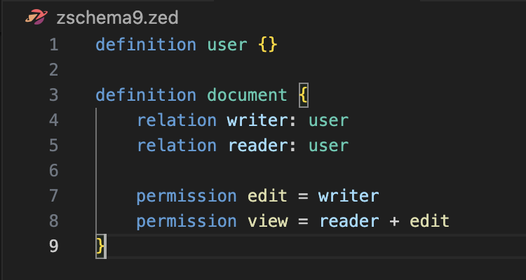
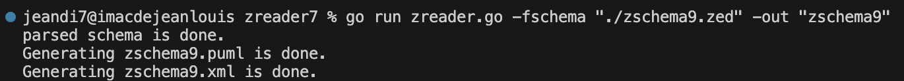
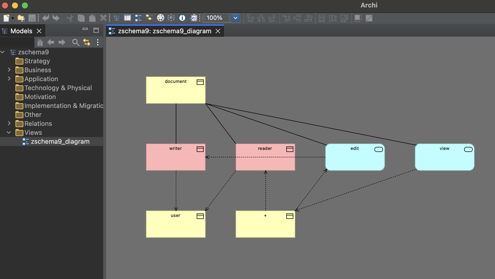

# Zanzibar SpiceDB-like Reader + PlantUML and Open Group ArchiMate® Model Exchange Generation Code  in less than 1700 lines of golang : part VII

[](https://opensource.org/licenses/MIT)


This part follows parts I to VI from the Zanzibar SpiceDB-like Reader.

Part V integrates the permission feature, and Part VI integrates the drawing generation (semantic part) for PlantUML only.

This part 

- adds a new export file in XML for drawing generation for Archi, an open-source software for practicing Enterprise Architecture.

- in addition to the PlantUML file generated (with the .puml extension), you will also have a second file with the same name generated for Archi (with the .xml extension).

Archi uses Open Group ArchiMate® Model Exchange File Format, which allows exchanging diagrams between solutions that implement ArchiMate®.

I have chosen to represent the definitions and relationships using ArchiMate® Business Objects, and the permission—which is a calculation—using an ArchiMate® Service.

Four prompts under Gemini were used to implement the XML export function for Archi.

The node network (Definitions, Relations, Permissions) is connected by arrows and is traversed breadth-first using a BFS-type algorithm.
BFS stands for Breadth-First Search, which translates to "Parcours en largeur" in French.

- Layer 0 (Roots): The BFS first finds all nodes that have no arrows pointing to them. These are generally the main Business Objects (such as user or resource).

- Layer 1: The BFS then looks at all nodes directly targeted by Layer 0 (e.g., the relations of your resource). 

- Layer 2: The BFS goes one level deeper to find the nodes targeted by Layer 1 (e.g., operators or derived permissions), and so on.

The icing on the cake :

Zanzibar and SpiceDB allow cycles (for example, a group that contains other groups). If we tried to draw this naively, the program would loop infinitely trying to find the end of the chain.

Thanks to the "visited nodes" mechanism in the BFS, cycles are properly detected and handled.


# Recall about the BNF grammar that is the same as in part V


```
// Zanzibar restricted EBNF grammar
// SpiceDB like
// relations and permissions are declared
// 

<Zschema> ::= <Zdef>*
<Zdef> ::= "definition" <Zname> "{" <Zbody> "}"
<Zname> ::= <identifier>
<Zbody> ::= (<Zrelation> | <Zpermission>)*     // * means zero or more <Zrelation> or <Zpermission>
<Zrelation> ::= "relation" <Rname> ":" <Sname> ("|" <Sname>)*
<Zpermission> ::= "permission" <Rname> "=" <RPexpr>
<RPexpr> ::= <RPterm> <RPexpr1>
<RPexpr1> ::= <Zop> <RPterm> <RPexpr1> | ''   // '' means RPexpr1 can be empty
<RPterm> ::= <Rname> | "(" <RPexpr> ")" | <Rname> "." "any" "(" <Rname> ")" | <Rname> "." "all" "(" <Rname> ")"
<Rname> ::= <identifier>
<Sname> ::= <Zname> | <Zname> "#" <Rname> | <Zname> ":" "*"
<Zop> ::= "+" | "&" | "-" | "->"     // I handle operator levels as the same priority.
<identifier> ::= [a-zA-Z_][a-zA-Z0-9_]*

```

*As usual, I had to ensure that there was no left recursion in RPexpr.*

# Example

With the zschema9.zed 




<span style="color:yellow">tape :</span> go run zreader.go -fschema "./zschema9.zed" -out "zschema9"

<span style="color:yellow">response: </span>




Then we import the zschema9.xml file into Archi



 *the automatically generated representation of the zschema9.zed file under Archi*


To be continued...

# Help mode

<span style="color:yellow">tape :</span> go run zreader.go -help

#

About Zanzibar : https://storage.googleapis.com/pub-tools-public-publication-data/pdf/0749e1e54ded70f54e1f646cd440a5a523c69164.pdf

About SpiceDB : https://authzed.com/blog/spicedb-is-open-source-zanzibar#everybody-is-doing-zanzibar-how-is-spicedb-different

About PlantUML : https://plantuml.com/fr/download

About Archi and ArchiMate® : https://www.archimatetool.com

About SpiceDB/Authzed and OpenAI  : https://authzed.com/customers/openai
